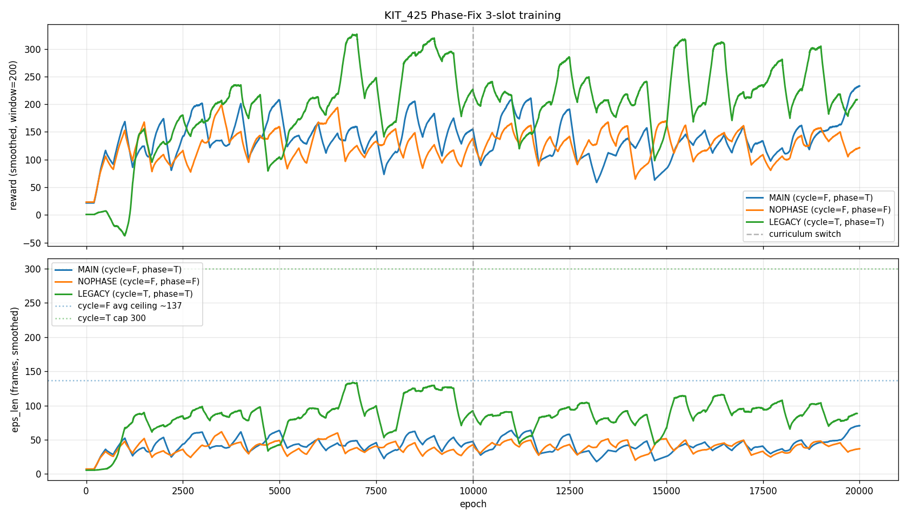

# KIT_425 Phase-Fix 3-slot 학습 완료 (2026-04-24)

상위 문서: `02_research_dev/260423_kit425_phase_fix_plan.md`
실험 설정: `exp_config/forward_walking/260423_KIT425_PHASEFIX/`

## 학습 완료 상태

세 슬롯 모두 20 000 epoch 도달 (약 13-15 시간 소요).

| Slot | Job | 최종 Ep | 최종 rwd | 최종 eps_len | 관찰 최고 rwd (smoothed) |
|------|-----|---------|----------|--------------|--------------------------|
| #1 MAIN (cycle=F, phase=T)    | 3942 | 20 001 | 206.7 | 62.9  | ~220 (Ep ~5k, ~13k) |
| #2 NOPHASE (cycle=F, phase=F) | 3943 | 20 001 |  74.7 | 22.8  | ~180 (Ep ~6k, post-switch 붕괴) |
| #3 LEGACY (cycle=T, phase=T)  | 3944 | 20 001 | 157.5 | 57.6  | ~260 (Ep ~14-19k, 말미 불안정) |

Episode-length 상한 참고:
- cycle=F 슬롯 (MAIN, NOPHASE): 평균 천장 ≈ 137 frames (clip avg 5.38s × 30fps × 0.85 init margin)
- cycle=T 슬롯 (LEGACY): `episode_length: 300` cap

→ **어떤 슬롯도 ceiling 근처에 못 미침.** Ablation 신호는 얻었지만 "완성된 워커"는 아님.

## 학습 커브



- 세로 점선 = Ep 10 000 (reward curriculum switch: task/disc 가중치 반전)
- smoothing window = 200 epochs

## Ablation 해석

1. **Phase obs 는 load-bearing.**
   NOPHASE 가 MAIN 을 Ep 10k 까지 거의 따라가다가 switch 이후 붕괴 (177 → 74.7 rwd). Per-clip phase obs (sin/cos) 가 cycle=False 에서 policy 의 stance/swing 구분에 필수.

2. **Per-clip phase fix 리팩터 기계적으로 작동.**
   이전 MULTICLIP_FWD (motion_id=0 hardcoded) 는 0% success 였음. 세 슬롯 모두 rwd 100+ 도달 → Task 4 리팩터 검증 완료.

3. **LEGACY rwd 최고지만 clean 비교 아님.**
   cycle=True 는 wrap 시 velocity 불연속이 있어 eps_len 이 pseudo-inflated 될 수 있음 (넘어져도 다음 사이클이 시작). MAIN 과 직접 수치 비교 부적절.

4. **세 슬롯 모두 말미 불안정.**
   MAIN: Ep 5k peak 이후 진동. LEGACY: Ep 14-19k peak 에서 최종 250 epochs 만에 150대로 급락. → **canonical (마지막) ckpt 가 best 아님** 가능성 매우 높음 → Task 9 에서 milestone 별 test-greedy 필요.

## 로컬 visualization 을 위한 파일 전송

체크포인트는 `.pth` 파일 (≈ 90 MB × 27 milestone) 로 git 에 안 올림 (gitignore + 용량).
로컬에서 IsaacGym 시각화 하려면 서버에서 scp 로 복사 필요.

```bash
# 각 슬롯 canonical 만 (3 × 90MB = 270MB)
scp server1:~/PHC/output/KIT425_MAIN.pth     ~/PHC/output/
scp server1:~/PHC/output/KIT425_NOPHASE.pth  ~/PHC/output/
scp server1:~/PHC/output/KIT425_LEGACY.pth   ~/PHC/output/

# 또는 milestone sweep 으로 2500/5000/…/20000 모두 (27 × 90MB = 2.4GB)
rsync -avz server1:~/PHC/output/KIT425_*.pth ~/PHC/output/

# 로컬 visualization (GPU 7.6GB 에서도 num_envs=1 로 가능)
conda activate phc
python phc/run.py \
  --task HumanoidImVICCmdMultiClip \
  --cfg_env exp_config/forward_walking/260423_KIT425_PHASEFIX/env_im_walk_vic_kit425_main.yaml \
  --cfg_train exp_config/forward_walking/260423_KIT425_PHASEFIX/im_walk_vic_kit425.yaml \
  --num_envs 1 --test --epoch -1 \
  --experiment KIT425_MAIN
# (--epoch N 으로 특정 milestone ckpt 지정 가능)
```

## 다음 단계 (Task 9 / 10)

- Task 9: milestone sweep (5k / 10k / 15k / 20k) × 3 slots 헤드리스 test-greedy. `av_reward`, `av_steps`, termination-reason breakdown (fall / clip_end / max_episode) 집계.
  - **canonical 이 best 인지 검증.** NOPHASE 는 5k/6k peak 가능성, LEGACY 는 14-17k peak 가능성.
- Task 10: 최종 결과 MD 작성 + finishing-a-development-branch skill.
