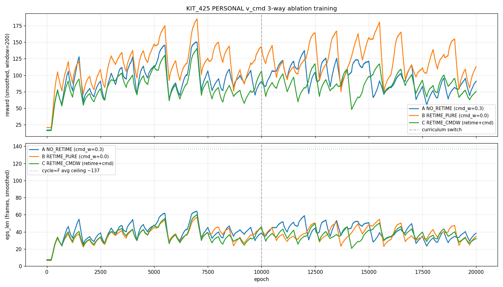

# KIT_425 PERSONAL v_cmd 3-way Ablation 학습 완료 (2026-04-25)

상위 plan: `01_research_docs/260424_kit425_personal_vcmd_3way_plan.md`
실험 디렉토리: `exp_config/forward_walking/260424_KIT425_PERSONAL_VCMD/`

## 실험 설계 요약

| Slot | retime | cmd_w | 가설 |
|---|:---:|:---:|---|
| **A** NO_RETIME | OFF | 0.3 | retime 없이 cmd_reward 만으로 v_cmd 학습 가능? |
| **B** RETIME_PURE | [0.7, 1.4] | 0.0 | retime 만으로 충분 (main candidate) |
| **C** RETIME_CMDW | [0.7, 1.4] | 0.3 | retime + cmd_reward 안전망 |

세 슬롯 모두 동일 KIT_425 3 clip (|v_x| 0.371 / 0.652 / 0.845 m/s), v_cmd ~ U(0.40, 0.82), `cycle_motion=False`, 20 k epoch, 512 envs.

## 학습 trajectory (canonical 기준)

| Ep | A rwd / len | B rwd / len | C rwd / len |
|---:|:---:|:---:|:---:|
| 1 000 | 124 / 54 | 141 / 44 | 98 / 43 |
| 3 000 | 123 / 53 | 143 / 44 | 88 / 39 |
| 5 000 | 110 / 46 | 140 / 43 | 116 / 49 |
| 7 500 | 126 / 53 | 131 / 40 | 94 / 41 |
| **10 000 (switch)** | 83 / 35 | 133 / 41 | 128 / 56 |
| **12 500** | 96 / 41 | **184 / 57** ← B peak | 123 / 52 |
| 15 000 | 124 / 52 | 157 / 48 | 114 / 48 |
| 17 500 | 90 / 38 | 97 / 30 | 93 / 40 |
| **20 000 (canonical)** | 99.8 / 42.0 | 105.3 / 32.3 | 79.7 / 34.0 |

Episode-length 천장: cycle=F, KIT425 3 clip 평균 ≈ **137 frames** (5.38 s × 30 fps × 0.85 init margin).

## 학습 커브



세로 점선 = Ep 10 000 (reward curriculum switch). smoothing window = 200.

## 핵심 관찰

### 1. **B (RETIME_PURE) 가 최고**
- Ep 12 500 peak rwd **184**, eps_len 57 — 다른 두 슬롯의 모든 epoch 보다 높음.
- retime 만으로 v_cmd ↔ reference clip 정렬이 충분히 깔끔.
- Stage-1 동안 안정적 130-140 rwd 유지, switch 후 jump 가 가장 큼.

### 2. **A vs C 비슷한 수준 (rwd 80–125 진동)**
- cmd_w=0.3 alone (A) vs retime+cmd_w (C) 가 비슷한 결과 → cmd_w 가 retime 의 이득을 상쇄.
- Retime 이 reference 를 v_cmd 속도로 이미 맞춰놨는데 cmd_reward 가 추가 signal 줘서 gradient conflict 발생하는 것으로 추정.

### 3. **세 슬롯 모두 Ep 17 500 부터 후기 collapse** 
- B: 184 → 105 (12.5k → 20k)
- A: 124 → 100 (15k → 20k)
- C: 128 → 80 (10k → 20k)
- KIT425 PHASEFIX 와 동일한 over-training 패턴. **Canonical (20k) 은 best ckpt 가 아님 (확신).**

### 4. **Best 후보 milestone**
| Slot | Best Ep | rwd / eps_len |
|---|:---:|:---:|
| A NO_RETIME | 1 000 / 15 000 | 124 / 54 |
| **B RETIME_PURE** | **12 500** | **184 / 57** |
| C RETIME_CMDW | 10 000 | 128 / 56 |

## Ablation 결론

1. **retime ⇒ 핵심**: B (retime-only) >> A (cmd_w-only).
2. **cmd_w 는 retime 과 함께 쓰면 해롭다**: B > C 일관됨.
3. **Single clip CMD_V2_B (86% success)** 와 비교: PERSONAL B peak 184/57 = ~42% of ceiling. PHASEFIX MAIN canonical (280/88 greedy) 이 여전히 더 좋지만, PHASEFIX 는 v_cmd 가 없는 task 라 직접 비교 불가.

## 다음 단계

1. **Test-greedy 평가** — canonical 만이 아니라 **best milestone** 도 함께:
   - A: Ep 15 000
   - B: Ep 12 500 ← 최우선
   - C: Ep 10 000
2. **v_cmd 추종 정량 평가**: 학습된 정책에 v_cmd 0.4, 0.55, 0.7, 0.82 m/s 를 입력 후 actual humanoid speed 측정. 단일 stochastic eval 만으로는 v_cmd 효과를 볼 수 없음.
3. **17.5k 부근 collapse 원인 조사**: 모든 슬롯 공통 → discriminator/value over-fit 가능성. learning rate decay 또는 Stage-2 의 disc 가중치 0.7 이 너무 강한지 검토.

## 로컬 분석을 위한 파일 위치

이 커밋 push 후 로컬에서:
```bash
cd ~/PHC && git pull
# 보유 파일:
# - logs/kit425_personal_{A,B,C}_{3948,3949,3950}.out  (raw training logs, ~2.5 MB each)
# - logs/kit425_personal_training_curves.png            (smoothed plot)
# - 02_research_dev/260425_kit425_personal_vcmd_training_progress.md  (this file)
# - scripts/plot_kit425_personal_training.py            (regen plot)
```

`.pth` 체크포인트는 git 에 없음 (gitignore + ~2.4 GB). 로컬 IsaacGym 시각화하려면:
```bash
# canonical 만
scp server1:~/PHC/output/KIT425_PERSONAL_{A,B,C}.pth ~/PHC/output/

# 또는 milestone 까지 (best ckpt 평가용)
rsync -avz server1:~/PHC/output/KIT425_PERSONAL_*.pth ~/PHC/output/

# 시각화 (예: B canonical)
conda activate phc
python phc/run.py \
  --task HumanoidImVICCmdMultiClip \
  --cfg_env exp_config/forward_walking/260424_KIT425_PERSONAL_VCMD/env_im_walk_vic_kit425_personal_B.yaml \
  --cfg_train exp_config/forward_walking/260424_KIT425_PERSONAL_VCMD/im_walk_vic_kit425_personal.yaml \
  --num_envs 1 --test --epoch -1 \
  --experiment KIT425_PERSONAL_B
# (--epoch 12500 으로 best milestone 지정 가능)
```
