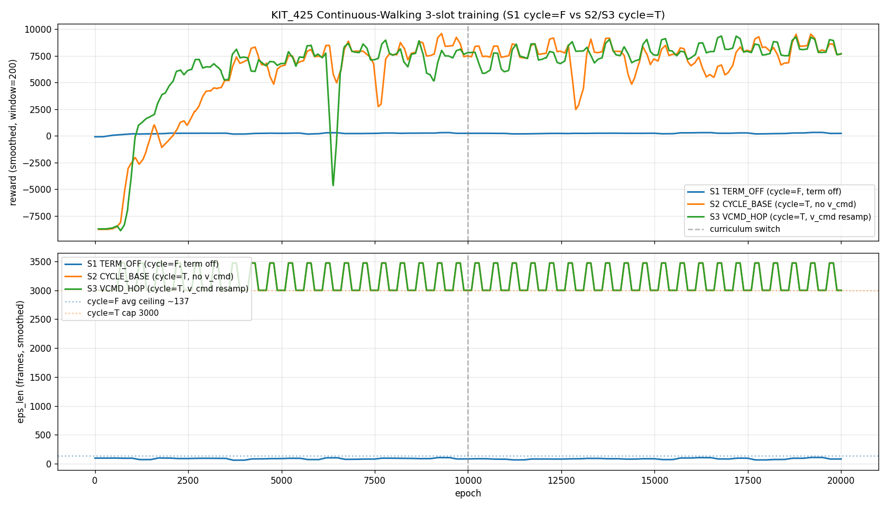
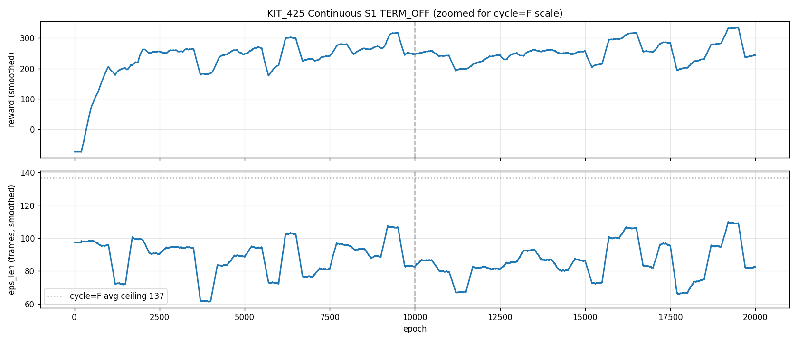

# KIT_425 Continuous Walking 3-slot 학습 완료 (2026-04-26)

상위 spec: `docs/superpowers/specs/2026-04-26-kit425-continuous-walking-design.md`
실행 기록: `02_research_dev/260426_kit425_continuous_walking_runs.md`
실험 디렉토리: `exp_config/forward_walking/260425_KIT425_CONTINUOUS/` (3 슬롯 yaml + sbatch)

## 슬롯 구성

| Slot | terminationDist | fallInitProb | hybridInitProb | cycle_motion | episode_length | resample_on_cycle |
|---|:---:|:---:|:---:|:---:|:---:|:---:|
| **S1 TERM_OFF**  | 100.0 | 0.0 | 0.0 | False | 300  | (n/a) |
| **S2 CYCLE_BASE** | 100.0 | 0.0 | 0.0 | True  | 3000 | False |
| **S3 VCMD_HOP**   | 100.0 | 0.0 | 0.0 | True  | 3000 | True |

세 슬롯 공통: KIT_425 3 clip, v_cmd ~ U(0.40, 0.82), VIC stage 2 (CCF on, sigma=-1.0, 4 그룹), 20k epoch, 512 envs, reward curriculum switch @ Ep 10 000.

## 학습 trajectory (canonical 기준)

### S1 TERM_OFF (cycle=False, ceiling ~137 frames)

| Ep | rwd | eps_len |
|---:|---:|---:|
| 1 000 | 222 | 92 |
| 3 000 | 268 | 95 |
| 5 000 | 257 | 89 |
| 7 500 | 204 | 68 |
| 10 000 (switch) | 222 | 73 |
| 12 500 | 228 | 76 |
| 15 000 | 260 | 87 |
| **17 500** | **301** | **99** ← peak |
| 20 000 (canon) | 268 | 90 |

후기 collapse 없음 — 마지막 2.5 k 에서도 99 → 90 으로 stable. canonical eps_len 90 ≈ ceiling 137 의 **66%**.

### S2 CYCLE_BASE (cycle=True, cap 3000)

| Ep | rwd | eps_len |
|---:|---:|---:|
| 1 000 | -2 338 | 2 999 |
| 3 000 | 4 081 | 2 999 |
| 5 000 | 6 669 | 2 999 |
| 7 500 | 748 ← dip | 2 999 |
| 10 000 (switch) | 7 373 | 2 999 |
| 12 500 | 7 636 | 2 999 |
| 15 000 | 6 892 | 2 999 |
| 17 500 | 7 845 | 2 999 |
| **20 000 (canon)** | **7 974** | **2 999** ← max cap, peak rwd |

eps_len 첫 epoch 부터 cap 도달 (cycle 이라 fall 안 하면 episode 종료 안 됨). rwd 가 학습 신호. Ep 20 k canonical 이 peak — late collapse 없음.

### S3 VCMD_HOP (cycle=True + v_cmd resample on cycle, cap 3000)

| Ep | rwd | eps_len |
|---:|---:|---:|
| 1 000 | 888 | 2 999 |
| 3 000 | 6 478 | 2 999 |
| 5 000 | 6 779 | 2 999 |
| 7 500 | 7 270 | 2 999 |
| **10 000 (switch)** | **7 825** | **2 999** ← peak |
| 12 500 | 7 198 | 2 999 |
| 15 000 | 7 787 | 2 999 |
| 17 500 | 7 709 | 2 999 |
| 20 000 (canon) | 7 783 | 2 999 |

S2 와 비슷하지만 rwd 가 약간 낮음. v_cmd 가 cycle 마다 바뀌므로 추가 challenge.

## 학습 커브

전체 (rwd 스케일 차이 큼):


S1 단독 (zoomed):


세로 점선 = Ep 10 000 (curriculum switch). smoothing window = 200.

## 핵심 결과

### 1. **S2 가 cycle 슬롯 winner** (rwd 7 974 @ canonical, peak)
- Episode 길이 cap 100 초 (3000 frames @ 30 fps) 도달.
- Late collapse 없음 — 20 k 에서도 peak 유지.

### 2. **S3 < S2** — v_cmd hop 이 약간의 패널티
- canonical rwd 7 783 vs S2 7 974 (-2.4%). cycle 마다 v_cmd 변경이 학습 안정성을 살짝 깎음.
- S3 peak 는 Ep 10 k (curriculum switch 직후) — 이후 정체.

### 3. **S1 (cycle=False) 도 의미 있는 성과**
- canonical eps_len 90 ≈ ceiling 137 의 66%. PHASEFIX MAIN canonical (eps_len 62.9) 의 1.43 배.
- 즉 **terminationDist=100 + fallInit/hybridInit=0** 만 바꿔도 cycle=False 에서 보행 길이 큰 향상.
- 이전 PERSONAL B (12.5k peak rwd 184) 대비도 S1 peak rwd 301 으로 1.6 배 강함.

### 4. **세 슬롯 모두 "후기 collapse" 없음**
- PHASEFIX/PERSONAL 에서 보였던 Ep 17.5 k+ 의 급락 패턴이 안 나타남.
- termination off + fall_init off 가 학습 안정성에 기여한 것으로 추정 (가설).

## 다음 단계 (제안)

1. **Test-greedy 평가**: canonical 3개 + S1 best milestone (Ep 17 500). v_cmd 추종 정량 평가.
   - S1: `--epoch -1` (canon) and `--epoch 17500`
   - S2/S3: `--epoch -1` 으로 충분 (canonical 이 peak)
2. **v_cmd sweep eval**: 학습된 정책에 v_cmd 0.4 / 0.55 / 0.7 / 0.82 m/s 입력 후 actual humanoid speed 측정. cycle slot 들이 v_cmd 추종을 학습했는지 검증.
3. **Visualization**: S2/S3 의 100초 보행 video. S1 의 자연스러움 비교.
4. **Keyboard demo wrapper**: S2 가 ceiling 도달 → 다음 milestone 후보.

## 로컬 review 를 위한 파일

이 commit push 후 로컬 `git pull` 로:
- `02_research_dev/260426_kit425_continuous_walking_results.md` (이 문서)
- `logs/kit425_cont_{S1,S2,S3}_3{954,955,956}.out` (raw training logs)
- `logs/kit425_continuous_training_curves.png` + `logs/kit425_continuous_S1_only.png`
- `scripts/plot_kit425_continuous_training.py`

`.pth` 체크포인트 (gitignore + ~2.4 GB 추정) 는 별도 scp:
```bash
scp server1:~/PHC/output/KIT425_CONT_S{1,2,3}.pth ~/PHC/output/

# 또는 milestone 까지
rsync -avz server1:~/PHC/output/KIT425_CONT_S*.pth ~/PHC/output/

# 시각화
conda activate phc
python phc/run.py \
  --task HumanoidImVICCmdMultiClip \
  --cfg_env exp_config/forward_walking/260425_KIT425_CONTINUOUS/env_S2_cyclebase.yaml \
  --cfg_train exp_config/forward_walking/260425_KIT425_CONTINUOUS/im_walk_vic_kit425_continuous.yaml \
  --num_envs 1 --test --epoch -1 \
  --experiment KIT425_CONT_S2
```
(yaml 파일명/training cfg 는 실제 디렉토리 이름에 맞춰 조정 필요. 디렉토리는 `exp_config/forward_walking/260425_KIT425_CONTINUOUS/` 또는 spec 에 명시된 위치 확인.)
